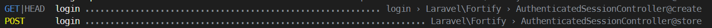
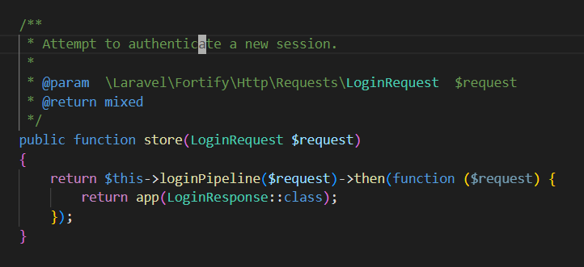
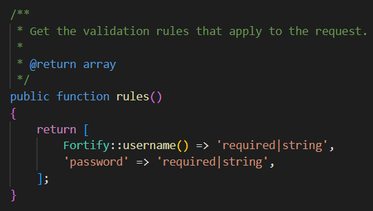

Ada di route list bagian login

Di method post, ada route login. kemudian memanggil method store di file AuthenticatedSessionController (ada di bagian kanan)

Kita bisa melihat controller defaultnya untuk mengetahui parameter apa yang akan di 'post' kan ke route login

kita bisa customize autentikasi ini di dalam file FortifyServiceProvider.php

function store mendapatkan LoginRequest, yg dimana terdapat func rules(), yaitu:

Dari sini, kita bisa lihat bahwa butuh 2 input, yaitu fortify parameter username (bisa di ctrl+click untuk mengecek apa itu), dan password

Tetapi, file di dalam vendor ini sebaiknya tidak diedit, oleh karena itulah ada file FortifyServiceProvider sebagai tempat untuk customization
