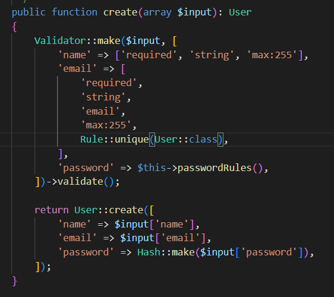
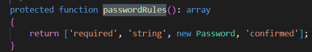

Cek parameter yg dibutuhin register route di folder Actions/Fortify/ di dalam sini, ada logika2 yg dibutuhkan
misal, ingin create new user, bisa dicek di file CreateNewUser.php

klo kita cek passwordRules()

ada password confirmation(dilihat dari tulisan 'confirmed')

